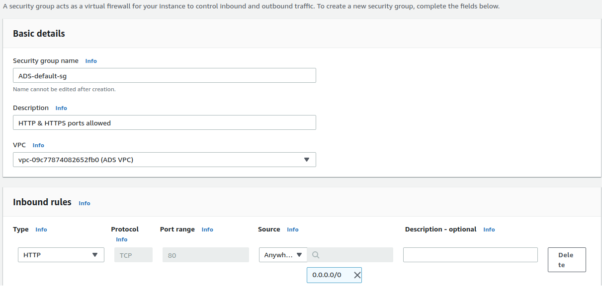
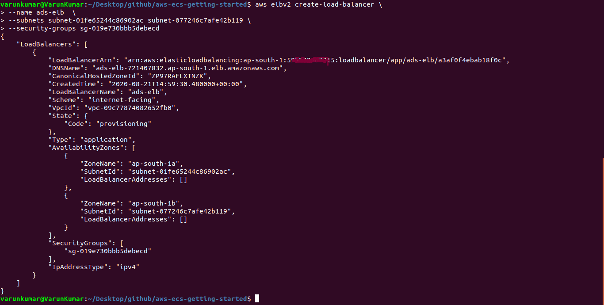
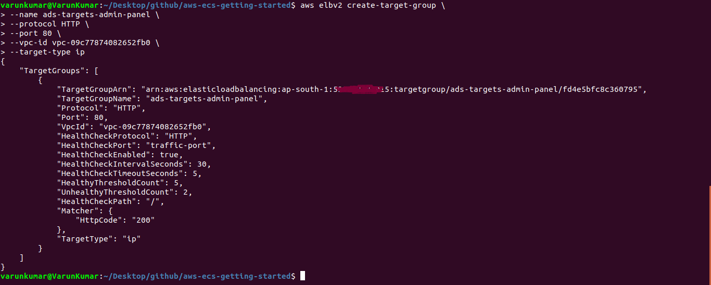
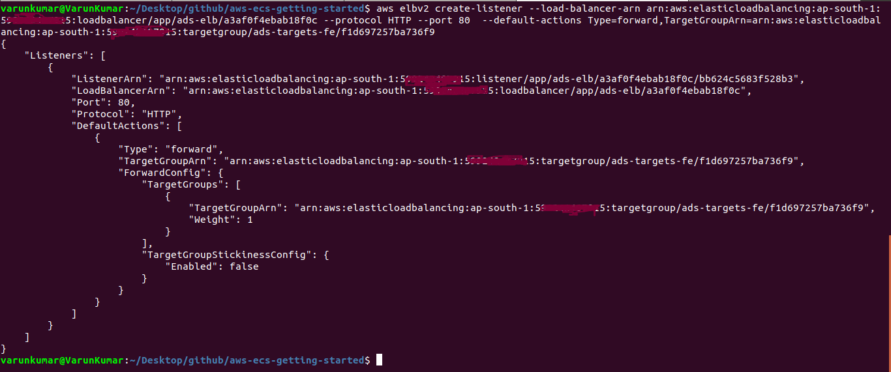
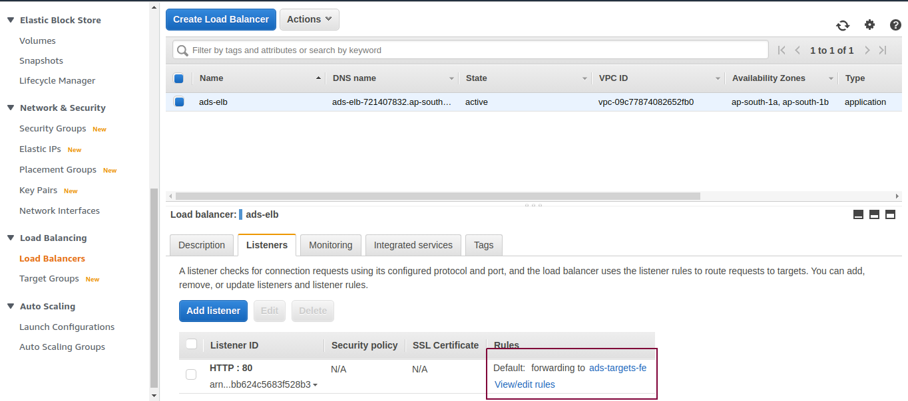
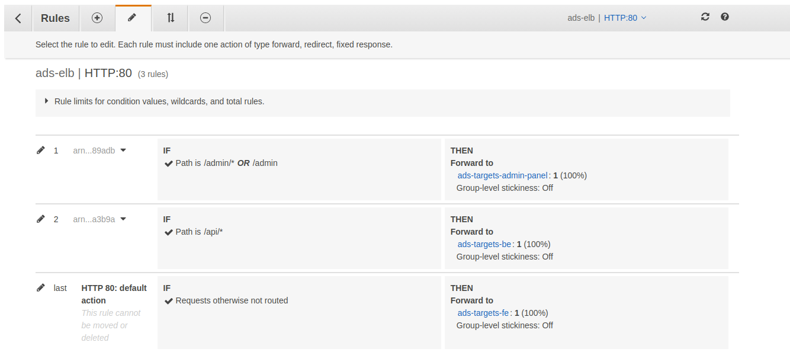
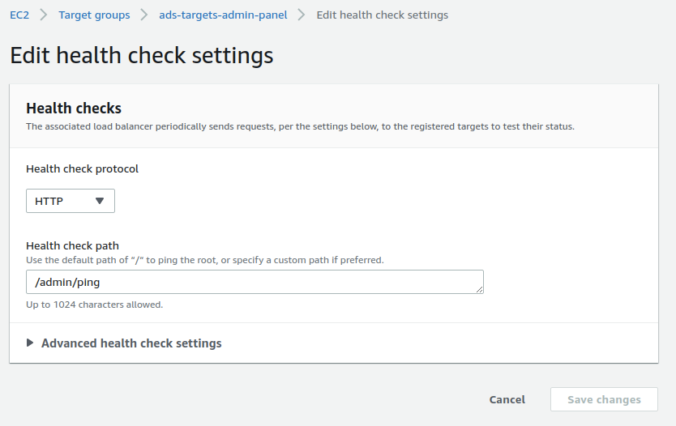
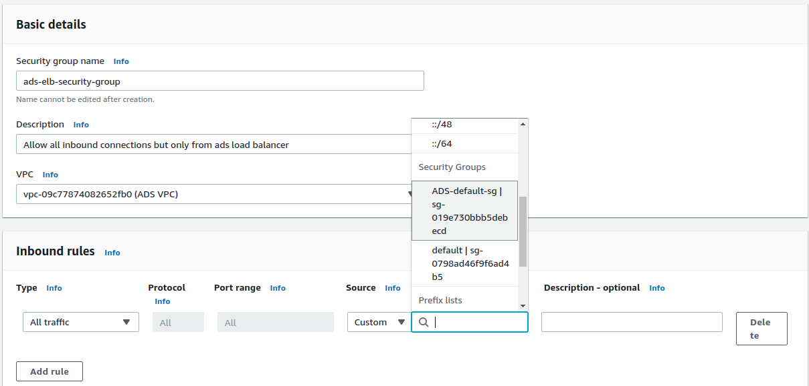

# aws-ecs-getting-started
Getting started with AWS ECS | Deployment in production

### Objective

To deploy my test app on AWS ECS. Test app has 3 microservices-

1. Frontend - Users facing side running on port 4000 and mounted on / route
2. Admin Panel- Internal tool running on port 5000 and mounted on /admin route
3. Backend- Backend for Frontend as well as Admin Panel, running on port 3000 and mounted on /api path

All the above 3 microservices will be deployed as docker container on ECS and connected via AWS Elastic Load Balancer(ELB).
Note that your container should be stateless so you should not deploy your database as container.  

## Prerequisite

1. [Install aws CLI](https://docs.aws.amazon.com/cli/latest/userguide/install-cliv2.html)
2. [Install docker](https://docs.docker.com/engine/install/)
3. [Configure aws cli](https://docs.aws.amazon.com/cli/latest/userguide/cli-configure-quickstart.html): `aws configure`


## ECR

### Building docker image

1. Clone the repository `git clone https://github.com/varunon9/aws-ecs-getting-started.git`
2. Move to project `cd aws-ecs-getting-started`
3. Build admin-panel docker image `docker build -t ecs-getting-started-admin-panel admin-panel`
4. Similarly build FE as well as BE: `docker build -t ecs-getting-started-be backend`, `docker build -t ecs-getting-started-fe frontend`
5. Verify that image has been successfully created `docker images --filter reference=ecs-getting-started-admin-panel`
6. Similarly for other two images `docker images --filter reference=ecs-getting-started-be` and `docker images --filter reference=ecs-getting-started-fe`
7. Verify that you can run it `docker run -t -i -p 5000:5000 ecs-getting-started-admin-panel`
8. Similarly for other two images `docker run -t -i -p 3000:3000 ecs-getting-started-be` and `docker run -t -i -p 4000:4000 ecs-getting-started-fe`


### Authenticating docker to Amazon ECR registry

1. Make sure that your IAM user has ECR access (AmazonEC2ContainerRegistry* policy)
2. `aws ecr get-login-password --region <region> | docker login --username AWS --password-stdin <aws_account_id>.dkr.ecr.<region>.amazonaws.com`
3. In above command replace `<region>` with your aws region e.g. ap-south-1 and replace `<aws_account_id>` with your AWS account ID.
4. You can find your AWS account ID from `consoleLoginLink` field of your aws IAM credentials. Visit [this](https://docs.aws.amazon.com/AmazonECR/latest/userguide/get-set-up-for-amazon-ecr.html) for more details.  


### Creating ECR repositories (only one time)

Admin-Panel-

```
aws ecr create-repository \
    --repository-name ecs-getting-started-admin-panel \
    --image-scanning-configuration scanOnPush=true \
    --region <region>
```

Backend-

```
aws ecr create-repository \
    --repository-name ecs-getting-started-be \
    --image-scanning-configuration scanOnPush=true \
    --region <region>
```

Frontend-

```
aws ecr create-repository \
    --repository-name ecs-getting-started-fe \
    --image-scanning-configuration scanOnPush=true \
    --region <region>
```

In above commands replace `<region>` with your aws region. This can also be done manually from [ECR console](https://ap-south-1.console.aws.amazon.com/ecr/home).
Do note that for above command to work, your IAM user must have write access to ECR. 


### Pushing image to ECR

1. Tag the Admin Panel image `docker tag ecs-getting-started-admin-panel:latest <aws_account_id>.dkr.ecr.<region>.amazonaws.com/ecs-getting-started-admin-panel:latest`
2. Push the Admin Panel image `docker push <aws_account_id>.dkr.ecr.<region>.amazonaws.com/ecs-getting-started-admin-panel:latest`
3. Tag the Backend image `docker tag ecs-getting-started-be:latest <aws_account_id>.dkr.ecr.<region>.amazonaws.com/ecs-getting-started-be:latest`
4. Push the Backend image `docker push <aws_account_id>.dkr.ecr.<region>.amazonaws.com/ecs-getting-started-be:latest`
5. Tag the Frontend image `docker tag ecs-getting-started-fe:latest <aws_account_id>.dkr.ecr.<region>.amazonaws.com/ecs-getting-started-fe:latest`
6. Push the Frontend image `docker push <aws_account_id>.dkr.ecr.<region>.amazonaws.com/ecs-getting-started-fe:latest`  
7. Check the [docs](https://docs.aws.amazon.com/AmazonECR/latest/userguide/getting-started-cli.html) for full reference


## VPC

Make sure that you have created and configured one VPC, [Docs](https://docs.aws.amazon.com/directoryservice/latest/admin-guide/gsg_create_vpc.html).
We would required id of two Subnets created here.

### Security Group

We also need to create one security group (allowing port 80) in VPC created above. 



## ELB

### Creating ELB

```
aws elbv2 create-load-balancer \
--name ads-elb  \
--subnets subnet-01fe65244c86902ac subnet-077246c7afe42b119 \
--security-groups sg-019e730bbb5debecd
```

In above command, replace `subnet-*` with your subnet ids and `sg-*` with your security group id. Make a note of `LoadBalancerArn` from output of above command.



### Creating Target Group (Admin Panel)

```
aws elbv2 create-target-group \
--name ads-targets-admin-panel \
--protocol HTTP \
--port 80 \
--vpc-id vpc-09c77874082652fb0 \
--target-type ip
```

In above command, replace `vpc-*` with your VPC id. Make a note of `TargetGroupArn` from output of above command.



### Creating Target Group (Backend)

```
aws elbv2 create-target-group \
--name ads-targets-be \
--protocol HTTP \
--port 80 \
--vpc-id vpc-09c77874082652fb0 \
--target-type ip
```

### Creating Target Group (Frontend)

```
aws elbv2 create-target-group \
--name ads-targets-fe \
--protocol HTTP \
--port 80 \
--vpc-id vpc-09c77874082652fb0 \
--target-type ip
```

### Creating Listener (for all 3 microservices)

```
aws elbv2 create-listener --load-balancer-arn <loadbalancer-arn> \
--protocol HTTP --port 80  \
--default-actions Type=forward,TargetGroupArn=<fe-targetgroup-arn>
```

In above command, replace `<loadbalancer-arn>` with LoadBalancerArn and `<fe-targetgroup-arn>` with TargetGroupArn of ads-targets-fe target group.

This will be common listener for all our 3 microservices and by default it will forward traffic to Frontend microservice.



### Updating Listener Rules

We have to mount our 3 microservices on different routes so we will have to modify rules of listener that we just created. Go to AWS ELB console and select ADS load balancer. Under Listeners tab of summary section, click on view/edit rules.



Add path based rule to forward traffics to our microservices basrd on route.



### Updating Health Check Settings

For each of the target groups that we created, default health check url would be `/` but we can change it to `/admin/ping` for Admin Panel, `/api/ping` for Backend and `/ping` for Frontend.



## ECS

### Creating Cluster

1. Make sure that your IAM user has ECS access (AmazonECS* policy)
2. `aws ecs create-cluster --cluster-name fargate-cluster`


### Register a Task Definitions

1. Visit [Cloudwatch console](https://ap-south-1.console.aws.amazon.com/cloudwatch/home) and create a log group `/ecs/aws-ecs-getting-started`.
2. Edit `admin-panel/fargate-task.json` file and replace all occurence of `<aws_account_id>` with your AWS account ID and `<region>` with your aws region
3. `aws ecs register-task-definition --cli-input-json file:///home/varunkumar/Desktop/github/aws-ecs-getting-started/admin-panel/fargate-task.json`
2. Edit `backend/fargate-task.json` file and replace all occurence of `<aws_account_id>` with your AWS account ID and `<region>` with your aws region
3. `aws ecs register-task-definition --cli-input-json file:///home/varunkumar/Desktop/github/aws-ecs-getting-started/backend/fargate-task.json`
2. Edit `frontend/fargate-task.json` file and replace all occurence of `<aws_account_id>` with your AWS account ID and `<region>` with your aws region
3. `aws ecs register-task-definition --cli-input-json file:///home/varunkumar/Desktop/github/aws-ecs-getting-started/frontend/fargate-task.json`
8. Do note that in above commands , I have specified full path of fargate-task.json file
9. Once task definition registration is complete, you can use `aws ecs list-task-definitions` to verify


### Creating Service

#### Creating Security Group for services

Create a security group that will be used during service registration of all the 3 microservices. This security group will allow any inbound connections from our load balancer `ads-elb` but restrict any public connection.
Make note of generated security group id. We would be using it in next steps.



#### Service Creation for Admin Panel

Edit `admin-panel/fargate-service.json` file and replace `targetGroupArn`, `securityGroups` & `subnets` with your values. Post that hit the following command-

```
aws ecs create-service \
--cli-input-json file:///home/varunkumar/Desktop/github/aws-ecs-getting-started/admin-panel/fargate-service.json \
--region ap-south-1
```

#### Service Creation for Backend

Edit `backend/fargate-service.json` file and replace `targetGroupArn`, `securityGroups` & `subnets` with your values. Post that hit the following command-

```
aws ecs create-service \
--cli-input-json file:///home/varunkumar/Desktop/github/aws-ecs-getting-started/backend/fargate-service.json \
--region ap-south-1
```

#### Service Creation for Frontend

Edit `frontend/fargate-service.json` file and replace `targetGroupArn`, `securityGroups` & `subnets` with your values. Post that hit the following command-

```
aws ecs create-service \
--cli-input-json file:///home/varunkumar/Desktop/github/aws-ecs-getting-started/frontend/fargate-service.json \
--region ap-south-1
```

You can verify service creation using `aws ecs list-services --cluster fargate-cluster`


### Visiting the app

Visit Load Balancers in AWS Console and select ADS ELB. Under Description tab you can find DNS name of this load balancer. Copy this and try opening in browser-


You can also verify that all your services and tasks are active in AWS ECS Console.

### Checking the logs

You can check all logs of this task under logs subtab or on [Cloudwatch console](https://ap-south-1.console.aws.amazon.com/cloudwatch/home)


### Deploy after changing codebase

If you make change to your codebase (e.g. backend microservice), you can follow following steps to re-deploy it-

1. Rebuild image `docker build -t ecs-getting-started-be backend`
2. Tag it `docker tag ecs-getting-started-be:latest <aws_account_id>.dkr.ecr.<region>.amazonaws.com/ecs-getting-started-be:1.1`
3. Push image to ECR `docker push <aws_account_id>.dkr.ecr.<region>.amazonaws.com/ecs-getting-started-be:1.1`
4. Edit `backend/fargate-task.json` file with updated image (the one that you just pushed to ECR) and update task definition using `aws ecs register-task-definition --cli-input-json file:///home/varunkumar/Desktop/github/aws-ecs-getting-started/backend/fargate-task.json`
5. List task definitions to get latest revision `aws ecs list-task-definitions`
6. Update service to use new task definition `aws ecs update-service --service ecs-getting-started-be --task-definition ecs-getting-started-be:2 --cluster fargate-cluster`

## Cleaning UP

1. Delete the service `aws ecs delete-service --cluster fargate-cluster --service fargate-service --force`
2. Delete the cluster `aws ecs delete-cluster --cluster fargate-cluster`